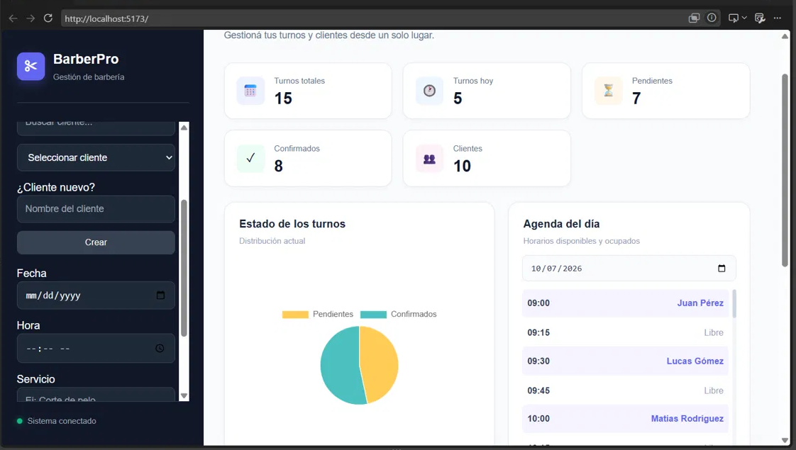

# Sistema de Turnos para Barbería

Aplicación web para gestionar los turnos de una barbería: permite agendar turnos eligiendo el tipo de servicio, y mantiene una base de datos de clientes y de turnos. Incluye además una sección de estadísticas.

## Funcionalidades

- Agendar turnos indicando cliente, fecha, hora y tipo de servicio
- Listado de turnos y vista de agenda por día
- Base de datos de clientes
- Estadísticas con gráficos
- API REST documentada con Swagger

## Tecnologías

| Capa | Stack |
|------|-------|
| Frontend | React, Vite |
| Backend | Node.js, Express |
| Base de datos | PostgreSQL |
| Documentación | Swagger |

## Estructura del proyecto

```
Sistema-Turnos/
├── Backend/
│   ├── src/
│   │   ├── controllers/   # Manejo de requests
│   │   ├── services/      # Lógica de negocio
│   │   ├── routes/        # Endpoints
│   │   ├── middleware/    # Manejo de errores
│   │   ├── db/            # Conexión a PostgreSQL
│   │   ├── docs/          # Configuración de Swagger
│   │   └── app.js
│   ├── seed.js            # Carga datos de prueba
│   ├── clear-seed.js      # Elimina los datos de prueba
│   └── .env.example
├── db/
│   └── tablas.sql         # Script de creación de tablas
└── Frontend/
    └── src/               # Componentes React
```

El backend sigue una arquitectura en capas (rutas → controladores → servicios → base de datos).

## Cómo correrlo

### Requisitos

- Node.js
- PostgreSQL

### 1. Base de datos

Creá una base de datos en PostgreSQL y ejecutá el script de tablas:

```bash
psql -U tu_usuario -d nombre_de_la_base -f db/tablas.sql
```

### 2. Backend

```bash
cd Backend
npm install
cp .env.example .env   # en Windows: copy .env.example .env
```

Completá el `.env` con los datos de tu base de datos y levantá el servidor:

```bash
npm run dev
```

Opcional: cargar datos de prueba (y borrarlos después):

```bash
node seed.js
node clear-seed.js
```

### 3. Frontend

```bash
cd Frontend
npm install
npm run dev
```

La app queda disponible en `http://localhost:5173`.

## Capturas

<!-- Agregá acá tus capturas: guardalas en una carpeta /docs o /screenshots y enlazalas -->

| Dashboard | 
|----------------|
|  | 

## Autor

**nicokp2** — [github.com/nicokp2](https://github.com/nicokp2)
